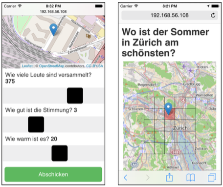

# Hyperlike prototype

Source code of my BSc thesis in computer science at the Zurich University of Applied Sciences (ZHAW)

**This is a prototype of the system outlined below.** The code is not suitable for production use.

## Overview

"Hyperlike" is a data sharing platform that allows users to rate a location based on a set of criteria configured by the operator of the application instance. Participants can view the result of the survey displayed on a continuously-updated map.

The implementation is a prototype of the system proposed in my bacheor's thesis. It was designed as a Java server providing a RESTful API to a JavaScript client running on the client.

## Building from source

Install dependencies (Ubuntu 14.04 LTS)
	
	apt-get install -y openjdk-7-jdk maven nodejs-legacy npm

Run build

	cd hyperlike-server && mvn package

## Deployment

 1. Put configuration file `config.json` into the current working directory
 1. Deploy the service by running `java -jar hyperlike-server.jar`

